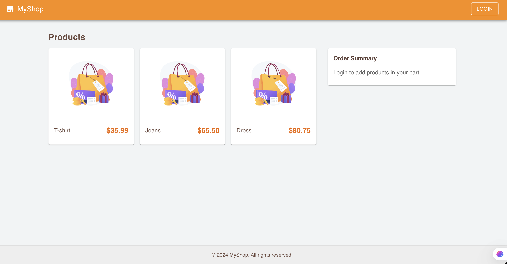
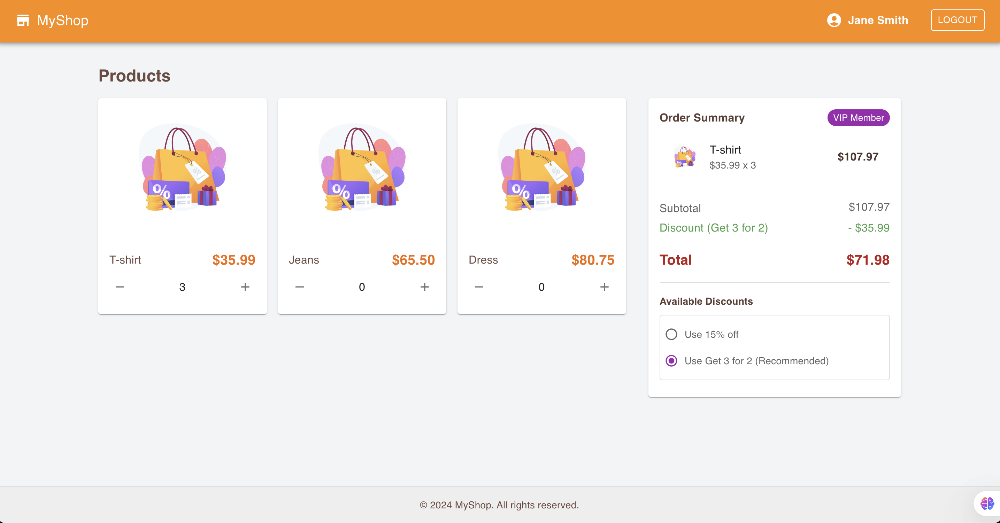

# E-commerce Application (in progress)

## Overview
The **E-commerce Application** is a full-stack web application that enables users to browse products, add them to their cart, and manage their shopping cart. The application consists of a React-based frontend and a Node.js backend, with a PostgreSQL database for data storage. It demonstrates modern development practices using TypeScript, Material-UI, Sequelize ORM, and REST APIs.

---

## Technologies Used

### Frontend
- React with TypeScript
- Material-UI
- Axios for API calls

### Backend
- Node.js with Express
- Sequelize ORM
- PostgreSQL
- dotenv for configuration management

---
### Project Structure
```bash
README
images/
  ├── logged
  ├── eslint.config.j
client/
  ├── .gitignore
  ├── eslint.config.js
  ├── index.html
  ├── package.json
  ├── public/
  ├── src/
  │   ├── api/
  │   ├── components/
  │   ├── contexts/
  │   ├── index.css
  │   ├── main.tsx
  │   ├── types/
  │   ├── utils/
  │   └── vite-env.d.ts
  ├── tsconfig.app.json
  ├── tsconfig.json
  ├── tsconfig.node.json
  └── vite.config.ts
server/
  ├── .env
  ├── .gitignore
  ├── app.js
  ├── config/
  │   └── config.json
  ├── controllers/
  ├── models/
  ├── package.json
  ├── routes/
  └── utils/
```

## Installation

### Prerequisites
- Node.js (v23.1.0)
- PostgreSQL (version 13 or later)
- npm or yarn


### Steps

1. Clone the repository:
   ```bash
   git clone https://github.com/malenacaroline/shopping-cart-app.git
   cd shopping-cart-app
   ```

2. Install dependencies:
   ```bash
    # You have to install dependencies for both client and server
    # Client
      cd client
      npm install
    # Server
      cd server
      npm install
   ```

3. Configure the database:
   - The database is hosted online, so once you run the backend server, the basic functionalities, such as creating products, users, and empty carts, will be pre-populated automatically, allowing you to quickly set up the basic functionality to manage cart items.
   - You can find the credentials in the file: `env-credentials.txt`

4. Run database migrations and seed data:
   ```bash
   cd server
   npm start
   ```

5. Start the application:
   ```bash
   # Start the backend
   cd server
   npm start

   # Start the frontend
   cd client
   npm run dev
   ```

6. Access the application:
  * You should have a .env file to create your credentials for the server
   - Frontend: `http://localhost:5143` (provided by Vite)
   - Backend API: `http://localhost:3002` (.env file)

7. Additional Notes:
  - You have 3 products created, 2 users and each user will have an empty cart. (pre-populated)
  - You have to login to get carts info, add and remove items.
  - Users credentials:
    ```bash
      - User 1 - VIP
        email: jane@test.com
        password: 12345
    ```
    ```bash
      - User 2 - Common
        email: john@test.com
        password: 12345
    ```
  - Every transaction in the cart is saved on the database, so you will not lose your information when refresh page.

8. Preview:
- Logged Out User:


- Logged In User:


---

## Project Structure

### Root Directory
- **/client:** Contains the frontend code.
- **/server:** Contains the backend code.

### Client Directory
- **/src:** Application source code.
  - **/components:** Reusable React components.
  - **/api:** API calls.
  - **/contexts:** Context of the application.
  - **/utils:** Utility functions.

### Server Directory  
  - **/config:** Configuration files for the database.
  - **/controllers:** Request handling logic.
  - **/models:** Sequelize models.
  - **/routes:** API routes.
  - **/utils:** Utility functions.

---

## API Endpoints

### User Routes
- `GET /api/users`: Fetch all users.
- `POST /api/users/login`: Authenticate user.

### Product Routes
- `GET /api/products`: Fetch all products.

### Cart Routes
- `GET /api/carts/:userId`: Get cart by user.
- `GET /api/carts/:cartId`: Get cart items by cart.
